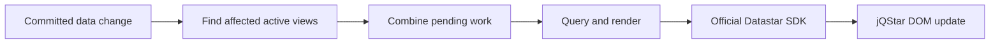

# Backend evolution discussion

Date: 2026-09-26

Status: discussion draft. These directions were retained for later discussion. They are not approved
implementation plans, shipped capabilities, or measured performance improvements.

The strongest opportunity is an optional backend companion that understands live views: what data
they depend on, who needs them, and when an update is worth sending. WebAssembly is a separate,
workload-dependent opportunity for shared computation.

## Starting point

jQStar already has scoped request cancellation, expected-version checks on project writes, bounded
table windows, official Datastar SDK responses, and explicit enhancement and disposal boundaries.
The backend currently proves these integrations rather than providing a general live view service.

The [resource-strategy experiment](decisions/RESOURCE_STRATEGY.md) selected coordinated server
patches for the Project Inspector. That decision remains the baseline. A backend companion should
demonstrate a concrete benefit before adding another permanent service or public API.

Useful repository references:

- [Architecture](ARCHITECTURE.md): kernel, plugins, protocol profiles, and render ownership.
- [Backend contract](BACKEND.md): requests, event-by-event patches, storage, and write conflicts.
- [Proof API](../server/api.ts): SDK responses, Project Browser output, and `sendWebResponse()`.
- [Project store](../server/project-store.ts): query and expected-version write boundaries.
- [Datastar handler](../src/protocol-datastar.ts) and [SSE parser](../src/sse.ts): incoming events.

## 1. Reactive backend views that account for demand

Consider a Project Browser with hundreds of connected users. A project changes status. The backend
should identify which filtered tables, counts, and selected-project panels might change, recompute
those views, and send ordinary Datastar HTML patches.

A proposed backend view definition would contain validated inputs, authorization scope, data
dependencies, and an HTML renderer. Begin with explicit dependencies, such as projects belonging to
one tenant. Automatic dependency discovery for arbitrary SQL would be a separate undertaking.

Queries and rendered results could be shared when subscribers have identical authorized output.
Sharing keys must account for tenant, permissions, filters, locale, template version, and any other
input that changes the result. Rendering can be shared while transmission still scales with the
number of connections.

The more interesting extension is allowing frontend demand to influence backend scheduling:

- An unopened activity panel can defer continuous rendering.
- A slow client displaying current status can receive the newest pending snapshot, with obsolete
  unsent snapshots replaced.
- A panel becoming active again receives a current authorized snapshot.
- Removing the final consumer releases its subscription and unnecessary pending work.

Delivery semantics must be explicit. Current-state snapshots can be combined. Audit entries and
other required events cannot simply be discarded. Visibility is a scheduling hint and never an
authorization decision.

Correctness needs more than tracking the rows currently displayed. An insert or edit can move a
record into or out of a filtered query, change its ordering, or change a count. Permission changes
must also invalidate affected output. Snapshot creation and subscription setup need a defined
handoff so a committed change cannot disappear between them.

This is not a claim of invention. [Convex](https://docs.convex.dev/realtime) tracks query
dependencies and caches results.
[Phoenix LiveView](https://phoenix-live-view.hexdocs.pm/Phoenix.LiveView.Engine.html) tracks
template changes. [Datastar](https://data-star.dev/guide/the_tao_of_datastar) already describes
long-lived read streams alongside short write requests. The opportunity is a useful combination
around existing databases, ordinary server templates, and Datastar-compatible HTML.

## 2. Versioned updates and predictable recovery

The current backend contract says stream events commit individually. If a later event fails, earlier
patches remain applied. Configured retries can replay partially applied output. The SSE parser reads
event IDs, but the Datastar handler does not use them to reject duplicates or resume a view.

An optional versioned-view contract should distinguish these concerns:

| Concern              | Proposed responsibility                                                            |
| -------------------- | ---------------------------------------------------------------------------------- |
| Current user intent  | Identify the active selection or search so an obsolete response cannot replace it. |
| Data freshness       | Compare revisions within a defined view scope and lifetime.                        |
| Interrupted delivery | Decide whether to resume retained events or request a fresh snapshot.              |
| Repeated writes      | Recognize a previously accepted command and return its recorded outcome.           |

A newer database revision can still belong to an obsolete search. Request identity and data revision
therefore cannot substitute for each other. Revision ordering also needs a restart policy, such as a
persistent sequence or a new epoch that forces a fresh snapshot.

Start recovery with fresh snapshots. Add durable replay only for workflows where intermediate events
matter. Bound retained history and define what happens when a cursor expires. Reauthorize reconnects
and replay against the current permission scope.

Related content should be rendered from one database snapshot and, where practical, patched as one
containing region. Several SSE events do not provide an atomic UI update. The existing render
transaction manages lifecycle ownership and enhancement; it is not a database-style rollback across
multiple stream events. Any stronger grouping contract would need separate design and testing.

For writes, record a command ID and its outcome transactionally with the mutation. Bind that ID to
the authorized caller and request content so it cannot be reused for a different operation. If a
response disappears after a successful save, a repeated command can return the recorded outcome.
External side effects require their own durable coordination beyond that database transaction.

Expected-version checks and command deduplication solve different problems: the former rejects a
stale overwrite, while the latter recognizes a repeated operation. Neither should be presented as an
unrestricted exactly-once guarantee.

The intended developer benefit is a reusable contract for slow responses, reconnects, and uncertain
saves, reducing the recovery logic each application block must maintain.

## 3. WebAssembly for shared computation

The strongest WASM candidate is a computational feature that benefits from the same implementation
running in the browser and backend.

For example, a scheduling tool could run a constraint solver in a browser worker while a user drags
assignments. On Save, the backend runs the same versioned solver against authoritative data, checks
permissions, and returns canonical HTML through Datastar. The local result remains a preview, and
the application explicitly reconciles differences after submission.

Other candidates include geometry, large file parsing, spreadsheet calculations, and document
transformations. Focused computational modules within HTML and JavaScript applications are an
established [WebAssembly use case](https://webassembly.org/docs/faq/).

Useful integration support would include worker ownership, cancellation, bounded work, versioned
inputs and results, and server reconciliation. Matching code alone does not guarantee matching
results: input data, clocks, randomness, numeric behavior, and module versions need defined rules.
Browser execution cannot establish permission or make client-supplied results authoritative.

Compare ordinary JavaScript in a worker with WASM before selecting an implementation. Include
download size, startup, serialization, memory, and data-transfer costs. Reusing an existing
Rust/C/C++ library may justify WASM even when raw execution speed is not the main benefit.

The current project table does not establish a need for WASM. Moving DOM patching or the reactive
runtime into WASM would need its own evidence. A shared computational module is the narrower first
experiment.

## 4. Immediate prerequisite: production stream handling

At the time of this discussion, `sendWebResponse()` reads from the SDK response and calls
`destination.write()` without checking its return value. Node uses `false` to indicate buffered
output and signals readiness through `drain`.
[Node HTTP documentation](https://nodejs.org/api/http.html#responsewritechunk-encoding-callback)

Before extending short proof responses into persistent live streams, address:

- Backpressure from the HTTP response through the source reader and producer.
- Disconnect propagation that cancels the reader and releases upstream subscriptions and work.
- Bounded queues, cleanup on errors, and an explicit policy for slow consumers.
- Deployment behavior through the actual proxy, including buffering, idle timeouts, and any
  streaming compression and flush policy.

Waiting for `drain` alone is insufficient if the producer continues filling another queue. Keep SSE
encoding in the official SDK while designing production pacing and cancellation around it.
Compression should be measured for both transferred bytes and update latency.

## First experiment and decision criteria

Use one live Project Browser workflow to compare the current approach with shared backend view
computation. Keep authorization, rendered output, and user-visible behavior equivalent.

| Scenario                                               | Evidence to collect                                               |
| ------------------------------------------------------ | ----------------------------------------------------------------- |
| Concurrent viewers with identical authorized queries   | Database executions and render CPU per committed change.          |
| Different filters, tenants, and permissions            | Correct sharing boundaries and absence of cross-scope output.     |
| Bursty edits and slow connections                      | Queue bounds, combined snapshots, memory, and eventual freshness. |
| Hidden, reopened, and removed panels                   | Deferred work, fresh activation, and subscription cleanup.        |
| Inserts, deletes, and changes to sort or filter fields | Correct membership, ordering, counts, and pagination.             |
| Rapid search or selection changes                      | Obsolete responses cannot replace the current intent.             |
| Disconnects, restarts, and expired cursors             | Predictable snapshot recovery or explicitly supported replay.     |
| Lost write response and repeated command               | One recorded mutation and a consistent command outcome.           |

Measure transferred bytes, database executions, render CPU, memory per connection, queue depth, and
time from mutation to completed browser enhancement. Record browser paint separately if the claim
concerns visual latency; response completion and `whenEnhanced()` are not paint measurements.

Set workload sizes and success thresholds before measuring. Keep the companion only if the observed
benefit justifies its memory, lifecycle, deployment, and maintenance costs. The WASM experiment
needs a separate real computational workload and its own baseline.

## Boundaries and questions for the next discussion

Begin as optional backend code plus a small client integration. Use existing public extension seams
where they suffice and identify any missing seam before expanding the core. Application
orchestration stays in registry blocks, reusable browser behavior belongs in `src/`, and native
HTML, links, forms, `$` as real jQuery, and `$name` as a signal remain intact. Datastar events
continue to come from `@starfederation/datastar-sdk`.

Questions to resolve before an implementation ticket:

- Which real application first needs live views, and which views require every event rather than
  only current state?
- Should the first backend adapter target the existing Node store boundary or a different host?
- What invalidation source covers all writers, including jobs and external services?
- What freshness and memory budgets are acceptable for active and inactive views?
- Can one snapshot region satisfy consistency needs, or is stronger grouping necessary?
- What authorization changes terminate or refresh a live subscription?
- Which computational feature would justify a shared WASM module?

Create implementation or research tickets through the [ticket workflow](tickets/README.md) once a
specific experiment is selected. This document preserves the discussion without changing the
existing architecture decisions or committing the project to new public APIs.
