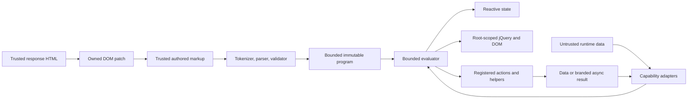

# CSP expression engine threat model

## 1. System overview

This model covers the published `jquery-star/csp` parser and evaluator specified by
`jqstar-csp-expression/1`. The separate trusted engine constructs JavaScript functions and exposes a
proxy-backed scope. The CSP entry is an explicit finite alternative, and importing it neither
installs a kernel nor configures a browser policy.

The CSP engine is a deterministic interpreter for trusted declarative markup. It is not an
attacker-code sandbox. It may read application data, write approved state paths, make bounded DOM
changes through reviewed jQuery methods, and invoke installed actions or helpers. Those calls retain
their application or plugin authority.

| Resource                                            | Security relevance                                                                                                                                                                                           |
| --------------------------------------------------- | ------------------------------------------------------------------------------------------------------------------------------------------------------------------------------------------------------------ |
| Expression source                                   | Trusted markup that selects capabilities and control flow.                                                                                                                                                   |
| State, computed values, event detail, and arguments | Runtime data; never treated as source, a selector, a property name, an action name, or a helper path.                                                                                                        |
| DOM and canonical jQuery values                     | Same-realm capabilities with a closed read/method table and application-root scoping.                                                                                                                        |
| Actions and helpers                                 | Trusted extension capabilities with their original network, DOM, and application authority.                                                                                                                  |
| Action/helper results                               | Data or an explicitly branded asynchronous result; never a new callable capability.                                                                                                                          |
| Parser programs and cache                           | Bounded per-engine derived state; invalid after disposal.                                                                                                                                                    |
| Diagnostics                                         | Authored source metadata only; never a serialization path for runtime objects or rejection causes.                                                                                                           |
| Response HTML                                       | Trusted markup because a patch can add expression-bearing `data-*` attributes that declarative enhancement compiles (`src/protocol-generic.ts:68`, `src/protocol-datastar.ts:64`, `src/declarative.ts:291`). |

## 2. Security model and trust boundaries

### Trust assumptions

- Application markup, expression-bearing response HTML, installed plugins, action implementations,
  helper implementations, the canonical jQuery peer, and the same-realm window/document are trusted.
- State values, form values, event detail, action arguments, JSON signal patches, request response
  data, and action/helper return data may be attacker-controlled.
- Authorization, CSRF protection, endpoint policy, HTML sanitization, Trusted Types, and safe output
  encoding remain application responsibilities.
- A Content Security Policy still governs scripts, styles, connections, frames, and other browser
  capabilities. The expression profile only removes dynamic code construction from its package entry
  graph.

### Boundaries and required properties

1. **Markup to program.** The tokenizer, parser, static validator, and cache accept only the closed
   grammar, reject ambient names and magic keys, apply deterministic limits, and retain exact source
   locations. No source reaches `eval`, `Function`, string timers, dynamic import, WebAssembly
   compilation, or a source-to-code substitute.
2. **Runtime data to evaluator.** Values cross explicit adapters. Data cannot become source text,
   selectors, HTML, property names, action names, helper paths, or arbitrary method names. Plain
   objects expose own data descriptors only; accessors, inherited properties, cycles, proxies that
   fail inspection, foreign-realm DOM, functions, and arbitrary thenables are rejected.
3. **Evaluator to state.** Only `$name` and safe `state`/`signals` paths are l-values. All access
   and writes repeat the safe-key check. A failed precondition causes no assignment or later call.
4. **Evaluator to DOM.** `$()` accepts a same-realm element capability or a source-literal selector
   scoped to the application root. The jQuery table is closed, collection sizes are bounded, and
   selector, HTML, class, attribute, property, and CSS names that grant structural authority are
   source literals.
5. **Evaluator to actions/helpers.** Calls target a source-literal registered action name or an
   exact helper leaf from the committed registry snapshot. The helper registry freezes
   null-prototype containers but deliberately leaves plugin-owned leaf values unfrozen. The runtime
   preserves callable-origin metadata separately and never trusts an arbitrary returned function
   value.
6. **Asynchronous result adoption.** Only a direct approved action/helper result may cross the async
   boundary. The expression runtime brands the raw result before promise assimilation and retains
   the action/request liveness callbacks. Arbitrary data thenables are rejected without reading a
   public `then` property.
7. **Patched markup to compiler.** Generic HTML and Datastar element responses call the patch
   capability (`src/protocol-generic.ts:68`, `src/protocol-datastar.ts:64`), and newly inserted
   expression attributes are later compiled (`src/declarative.ts:291`). Deployments must treat that
   response channel as trusted markup. JSON/Datastar signal patches remain data.
8. **Lifecycle.** Disposal clears program state and invalidates retained evaluators. Kernel disposal
   disposes the engine and releases its ownership claim. A unique engine object cannot be shared
   between kernels. A live incompatible installation cannot be replaced silently.

## 3. Threat scenarios and controls

| Priority | Scenario                                                                                                                                                                               | Required control and evidence                                                                                                                                                                                                              |
| -------- | -------------------------------------------------------------------------------------------------------------------------------------------------------------------------------------- | ------------------------------------------------------------------------------------------------------------------------------------------------------------------------------------------------------------------------------------------ |
| Critical | An expression or runtime value reaches dynamic code construction.                                                                                                                      | The CSP entry graph contains no dynamic-code primitive. Adversarial fixtures cover `eval`, `Function`, string timers, import payloads, and WebAssembly. Parsed package scans and the strict-policy browser proof run on the exact tarball. |
| Critical | Data selects a property chain such as `constructor.constructor`, a callable `call`/`apply`/`bind`, or a helper/action result method.                                                   | Decode then reject every magic segment before each read, write, and call. Use origin-tagged capabilities rather than duck typing. Run all prototype/constructor and callable-escalation fixtures.                                          |
| High     | A selector or jQuery chain escapes the application root, reaches a foreign realm, invokes a plugin method, registers callbacks, performs network access, or constructs HTML from data. | Root-scope literal selectors, bind adapters to the kernel realm and canonical jQuery, enforce the closed method/signature table, cap results, and reject nonliteral authority-bearing arguments.                                           |
| High     | An unregistered function becomes callable through state, computed data, event detail, arguments, a data descriptor, or a call result.                                                  | Permit call nodes only when static origin is a registered action, exact committed helper leaf, `$()`, or a reviewed method on a tracked capability. Reject functions everywhere else.                                                      |
| High     | An arbitrary thenable executes code during inspection or adoption.                                                                                                                     | Never read public `then` on data. Brand async results at the action/helper dispatch boundary before JavaScript promise assimilation and adopt the brand once, with an eight-result chain cap.                                              |
| High     | Attacker-controlled response HTML injects new expression source.                                                                                                                       | Document expression-bearing HTML responses as trusted markup; authenticate and authorize endpoints, sanitize any attacker-derived markup before it reaches the patch response, and test post-patch enhancement under the CSP engine.       |
| High     | Prototype getters, inherited properties, proxies, cycles, or cross-realm objects execute code or bypass classification.                                                                | Read own data descriptors, reject accessors/inheritance/foreign capabilities, check safe keys at every hop, track identity for path traversal, and fail closed on proxy traps.                                                             |
| Medium   | Oversized source, ASTs, collections, paths, calls, or async chains consume excessive CPU/memory.                                                                                       | Apply the frozen compile/evaluation limits in the specified first-failure order. Test exactly-at and one-above vectors for every limit plus repeated-evaluation stress.                                                                    |
| Medium   | Partial mutation or a DOM/action call occurs before a later validation error.                                                                                                          | Validate target, operands, arguments, method signature, result bounds, and remaining step budget before the externally visible operation. Test failure side effects explicitly.                                                            |
| Medium   | Diagnostics disclose state, DOM, credentials, response content, or rejection data.                                                                                                     | Include only the stable code, phase, grammar version, bounded authored-source excerpt, attribute, and exact span. Never stringify runtime values or causes.                                                                                |
| Medium   | A cached program or evaluator survives disposal or is shared between kernels incorrectly.                                                                                              | Keep caches per engine, invalidate retained evaluators, test disposal/reinstall semantics, and resolve the current ownership-claim ambiguity before implementation.                                                                        |
| Low      | Trusted and CSP engines silently disagree on public examples.                                                                                                                          | Keep stable shared case IDs, replay exact-parity cases, inventory public sources, and require every difference to be `csp-equivalent`, `migration-required`, or `intentionally-unsupported`.                                               |

The canonical attack payloads live in `test/fixtures/csp/adversarial.json`; their executable setup
recipes live in `test/fixtures/csp/contexts.json`. Positive, denied, boundary, diagnostic,
public-inventory, and shared-conformance evidence lives beside them and is checked by
`npm run test:csp-contract`.

## 4. Severity calibration and downstream gates

Use impact and reachability together:

- **Critical:** attacker-controlled data or markup causes arbitrary JavaScript execution without an
  already-authorized application action/helper, or escapes the CSP entry graph into a dynamic-code
  primitive.
- **High:** capability escalation crosses root, realm, registry, network, callable-origin, or
  prototype boundaries; or attacker-controlled patched markup is accepted where the deployment
  claimed a data-only boundary.
- **Medium:** deterministic resource exhaustion, observable partial effects, sensitive diagnostic
  disclosure, stale evaluator reuse, or a contract mismatch that requires an additional
  precondition.
- **Low:** compatibility or diagnostic-quality defects without a demonstrated confidentiality,
  integrity, availability, or authority impact.

The package gate proves the published subpath graph contains no dynamic-code construction, runs the
frozen corpus through the exact ESM and CommonJS artifacts, and exercises generic JSON/HTML plus
official-SDK Datastar patches under a response-header policy in Chromium, Firefox, and WebKit. The
proof records early policy events and reports, runtime canaries, native no-JavaScript behavior,
operations, and exact disposal without expanding the trust boundary above.

Revisit this model when the grammar version changes, a capability/method table expands, helper or
action dispatch changes, response patching gains a new source, the package entry graph changes, or a
new browser realm boundary is introduced.
